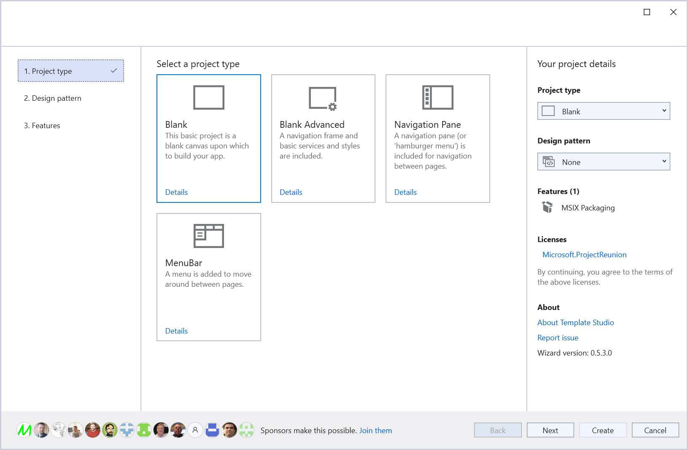
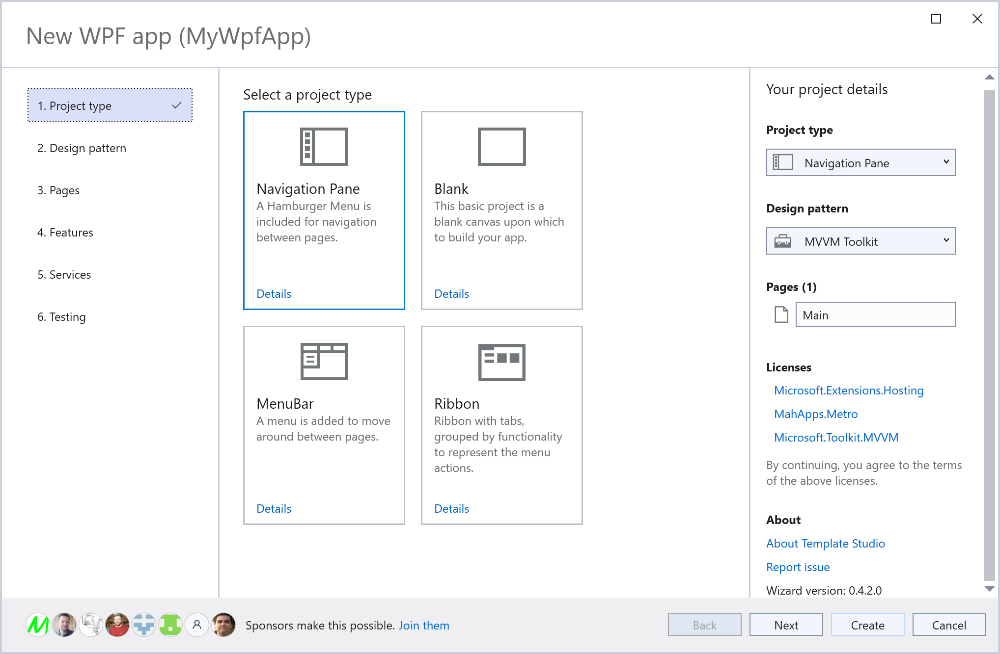

> **Warning**  
> This repo should be considered archived. I created it when Windows Template Studio was no longer maintained so I could keep the functionality available.  
> As a result of creating this repo and porting the code to work with VS2022 someone from Microsoft restarted the original project (my code) as [Template Studio](https://github.com/microsoft/TemplateStudio) (They dropped "Windows" from the name.)  
> I created a [separate project to provide .NET MAUI support](https://github.com/mrlacey/MauiAppAccelerator).

---

# Matt's Template Studio

Improve the File > New experience and accelerate the creation of apps in **Visual Studio 2022**.

My personal, early previews for what's coming to [[Windows] Template Studio](https://aka.ms/wts).

## Matt's Template Studio for UWP - [get it](https://marketplace.visualstudio.com/items?itemName=MattLaceyLtd.TemplateStudioForUWP)

Bringing the [Windows Template Studio](https://aka.ms/wts) experience for building Universal Windows Platform (UWP) apps to **Visual Studio 2022**.  
Currently in preview while final bugs are addressed.

Differences with the functionality in Windows Template Studio:

- Updated dependencies in generated apps.
- Removed deprecated frameworks.
- English only.
- Actively maintained.
- Added WebView2.

Please [try it out](https://marketplace.visualstudio.com/items?itemName=MattLaceyLtd.TemplateStudioForUWP) and [create issues for any bugs, questions, or suggestions](https://github.com/mrlacey/TemplateStudio/issues/new).

## MAUI App Accelerator (AKA Template Studio for.NET MAUI)

Available from the [marketplace](https://marketplace.visualstudio.com/items?itemName=MattLaceyLtd.MauiAppAccelerator)

## Matt's Template Studio for WinUI (C#) - [preview](https://marketplace.visualstudio.com/items?itemName=MattLaceyLtd.TemplateStudioForWinUI)

Bringing the [Windows Template Studio](https://aka.ms/wts) experience for building apps to WinUI and **Visual Studio 2022**.  
Currently in preview while final bugs are addressed.

This was an early preview and [Microsoft are now acitvely maintaining a version](https://marketplace.visualstudio.com/items?itemName=TemplateStudio.TemplateStudioForWinUICs).

## Matt's Template Studio for WPF - [preview](https://marketplace.visualstudio.com/items?itemName=MattLaceyLtd.TemplateStudioForWPF)

Bring the Windows Template Studio experience for building WPF apps to **Visual Studio 2022**.  
Currently in preview while final bugs are addressed.

This was an early preview and [Microsoft are now acitvely maintaining a version](https://marketplace.visualstudio.com/items?itemName=TemplateStudio.TemplateStudioForWPF).

## Template Studio for ???

What else would you like to see here?
[Create an issue](https://github.com/mrlacey/TemplateStudio/issues/new) (or comment on an existing one) with details.  
I have my own ideas too. ;)
