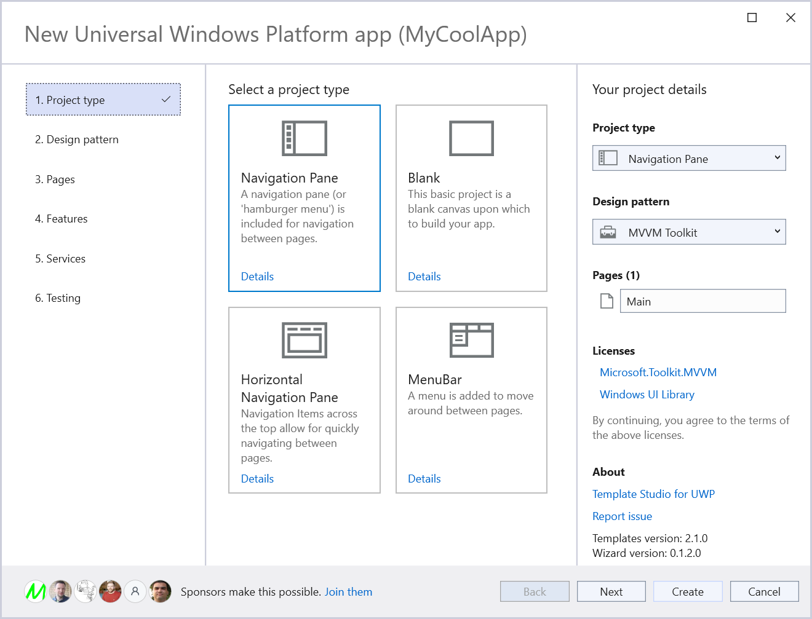

# Template Studio

Improve the File > New experience and accelerate the creation of apps in **Visual Studio 2022**.

## Template Studio for UWP - [preview](https://marketplace.visualstudio.com/items?itemName=MattLaceyLtd.TemplateStudioForUWP)

Bringing the [Windows Template Studio](https://aka.ms/wts) experience for building Universal Windows Platform (UWP) apps to **Visual Studio 2022**.  
Currently in preview while final bugs are addressed.

Differences with the functionality in Windows Template Studio:

- Updated dependencies in generated apps.
- Removed deprecated frameworks.
- English only.

Please [try it out](https://marketplace.visualstudio.com/items?itemName=MattLaceyLtd.TemplateStudioForUWP) and [create issues for any bugs, questions, or suggestions](https://github.com/mrlacey/TemplateStudio/issues/new).

## Template Studio for WPF - coming soon

Bring the Windows Template Studio experience for building WPF apps to Visual Studio 2022.  
**Preview coming soon.**

## Template Studio for WinUI

Hopefully coming soon.  
More details will follow.

## Template Studio for ???

What else would you like to see here?
[Create an issue](https://github.com/mrlacey/TemplateStudio/issues/new) (or comment on an existing one) with details.  
I have my own ideas too. ;)
